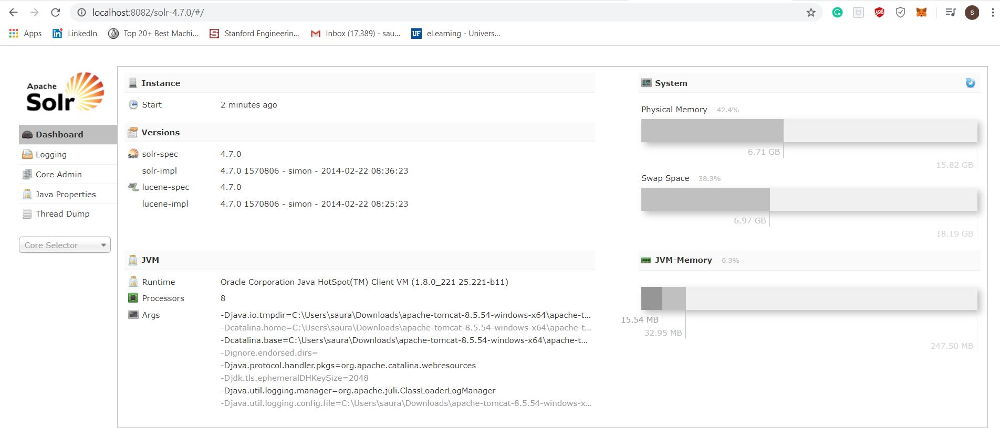

# Enterprise-Search-Application-Apache-Solr

First we need to install Solr on local.
Follow the below steps:
1) we will deploying solr(.war) on local tomcat just like any other .war file. To do this, downlaod apache solr (https://archive.apache.org/dist/lucene/solr/4.7.0/) and download tomcat.&nbsp;

2) --copy the solr.war file from your-local-solr-folder/example/webapps &nbsp;
3) --copy the solr folder  from your local-solr-folder/example to "bin" folder of tomcat (as shown in screeshot 1 above)&nbsp;

4) start the tomcat and hit the url localhost:8080/solr, this will take to you the the solr home page (shown in screenshot 2 below)&nbsp;

